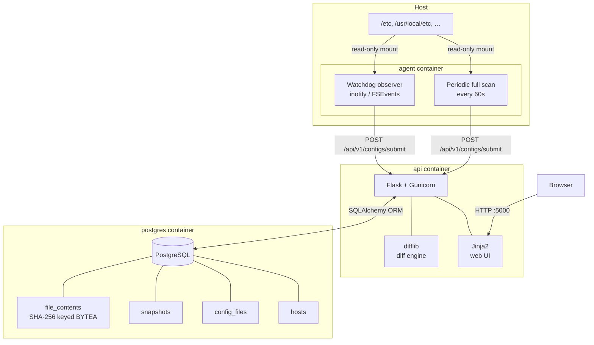

# Custom Configuration Tracker

A containerized CMDB (Configuration Management Database) that tracks configuration file changes across hosts. A Python agent monitors host filesystems (mounted read-only) and ships file content to a Flask REST API, which stores every version in PostgreSQL using content-addressable storage. A built-in web UI provides browsable history, side-by-side diffs, and syntax-highlighted file content.

## Architecture



**Three containers, one bridge network:**

| Container | Role |
|-----------|------|
| `postgres` | Stores hosts, tracked file paths, snapshots metadata, and raw file content (BYTEA) |
| `api` | Flask + Gunicorn REST API and server-rendered web UI; computes diffs with `difflib` |
| `agent` | Scans monitored paths (read-only mount), hashes files with SHA-256, POSTs changes to the API |

### Content-addressable storage

Identical file content is stored exactly once. The `file_contents` table is keyed by SHA-256 hash — submitting the same bytes twice results in one row. `snapshots` rows reference `file_contents` by hash, giving a complete point-in-time history without duplication.

### Change detection

Detection is dual-mode for reliability:

- **Watchdog** (inotify/FSEvents) — fires within milliseconds of a filesystem event
- **Periodic scan** (default: 60s) — full sweep fallback; catches events watchdog can miss under heavy write storms

Both paths feed into the same submit function. The server performs its own hash dedup so retries and restarts are always safe.

## Requirements

- Docker and Docker Compose v2
- Git (to clone this repo)

## Getting Started

**1. Clone and configure**

```bash
git clone git@github.com:archdukejim/custom-configuration-tracker.git
cd custom-configuration-tracker
cp .env.example .env
```

Edit `.env`:

```bash
# Strong password for the cmdb postgres user
POSTGRES_PASSWORD=changeme

# Flask secret key — generate with:
# python -c "import secrets; print(secrets.token_hex(32))"
API_SECRET_KEY=changeme

# Stable UUID for this agent — generate once per host with:
# python -c "import uuid; print(uuid.uuid4())"
AGENT_ID=00000000-0000-0000-0000-000000000000

# Human-readable display name for this host
AGENT_HOSTNAME=my-server
```

**2. Configure monitored paths**

Edit the `agent` service volumes in `docker-compose.yml`:

```yaml
volumes:
  - /etc:/monitored/etc:ro
  - /usr/local/etc:/monitored/usr/local/etc:ro
  # Add more :ro mounts here
```

**3. Start the stack**

```bash
docker compose up --build -d
```

Startup is health-check ordered: postgres → api → agent. The API is available at `http://localhost:5000`.

**4. Verify**

```bash
# Web UI
open http://localhost:5000

# API health check
curl http://localhost:5000/api/v1/health
```

## Web UI

| Route | Description |
|-------|-------------|
| `/` | Dashboard — all hosts, last-seen, file count, 24h change activity |
| `/hosts/<hostname>` | File list with live search/filter, snapshot counts, sizes |
| `/hosts/<hostname>/history?file_path=` | Snapshot timeline with "Diff vs prev" links |
| `/hosts/<hostname>/diff?…` | GitHub-style unified diff with line numbers and +/- counts |
| `/hosts/<hostname>/content?…` | Syntax-highlighted file content (Prism.js autoloader) |

## REST API

All endpoints return `application/json`. Errors include `{"error": "…"}`.

### Hosts

| Method | Endpoint | Description |
|--------|----------|-------------|
| `GET` | `/api/v1/hosts` | List all known hosts |
| `GET` | `/api/v1/hosts/<hostname>` | Host detail — file count, last snapshot time |
| `POST` | `/api/v1/hosts/register` | Agent self-registration (upsert) |

**Register body:**
```json
{ "hostname": "web-01", "agent_id": "<uuid>", "metadata": {} }
```

### Configs

| Method | Endpoint | Description |
|--------|----------|-------------|
| `POST` | `/api/v1/configs/submit` | Submit a changed file (`multipart/form-data`) |
| `GET` | `/api/v1/configs/<hostname>` | List tracked files with latest hash and snapshot time |
| `GET` | `/api/v1/configs/<hostname>/history?file_path=` | Snapshot list (newest first) |
| `GET` | `/api/v1/configs/<hostname>/content?file_path=&snapshot_id=` | Raw file bytes at a snapshot |
| `GET` | `/api/v1/configs/<hostname>/diff?file_path=&from_snapshot_id=&to_snapshot_id=` | Unified diff as `text/plain` |

### Health

```bash
GET /api/v1/health
# → {"status": "ok", "db": "ok"}
```

## Agent

### Behavior

1. On startup, registers with the API (retries with exponential backoff).
2. Starts a **watchdog** observer on all monitored paths.
3. Runs a **full scan** every `poll_interval_seconds` (default: 60s).
4. Skips symlinks and files larger than `max_file_size_mb` (default: 10 MB).
5. In-memory SHA-256 cache avoids redundant API calls within a session; server-side dedup handles restarts.

### Environment Variables

| Variable | Required | Description |
|----------|----------|-------------|
| `AGENT_ID` | Yes | Stable UUID identifying this agent instance |
| `CMDB_API_URL` | Yes | API base URL (e.g. `http://api:5000`) |
| `AGENT_HOSTNAME` | No | Display name; defaults to container hostname |
| `MONITORED_PATHS` | No | Comma-separated paths to scan; overrides `config.yml` |
| `LOG_LEVEL` | No | `DEBUG` / `INFO` / `WARNING` (default: `INFO`) |
| `CONFIG_PATH` | No | Path to `config.yml` (default: `/app/config.yml`) |

### Multiple Agents

Deploy the `agent` container on each host you want to monitor. Each agent needs a unique `AGENT_ID` and `AGENT_HOSTNAME` and points to the same `CMDB_API_URL`. The API and postgres containers are shared.

## Project Structure

```
custom-configuration-tracker/
├── docker-compose.yml
├── init.sql                   # PostgreSQL schema (auto-runs on first boot)
├── .env.example
├── api/
│   ├── app.py                 # Flask app factory + Jinja2 filters
│   ├── models.py              # SQLAlchemy: Host, ConfigFile, FileContent, Snapshot
│   ├── diff_utils.py          # difflib wrapper + unified diff line parser
│   ├── language_map.py        # File extension → Prism.js language identifier
│   ├── requirements.txt
│   ├── Dockerfile
│   ├── routes/
│   │   ├── hosts.py           # /api/v1/hosts
│   │   ├── configs.py         # /api/v1/configs
│   │   └── web.py             # / and /hosts/* (web UI)
│   └── templates/
│       ├── base.html
│       ├── dashboard.html
│       ├── host_detail.html
│       ├── history.html
│       ├── diff.html
│       └── content.html
└── agent/
    ├── agent.py               # Watchdog + poll loop + API client
    ├── config.yml
    ├── requirements.txt
    └── Dockerfile
```

## Database Schema

```
hosts           — registered agents (hostname, agent_id, last_seen, metadata)
config_files    — tracked paths per host
file_contents   — content-addressable store (SHA-256 hash → BYTEA)
snapshots       — point-in-time records linking config_files → file_contents
```

## Operations

**View logs:**
```bash
docker compose logs -f api
docker compose logs -f agent
```

**Inspect the database:**
```bash
docker compose exec postgres psql -U cmdb -d cmdb
```

```sql
-- List hosts and their file counts
SELECT h.hostname, COUNT(cf.id) AS files, h.last_seen
FROM hosts h LEFT JOIN config_files cf ON cf.host_id = h.id
GROUP BY h.id ORDER BY h.last_seen DESC;

-- Find most frequently changed files
SELECT h.hostname, cf.file_path, COUNT(s.id) AS changes
FROM snapshots s
JOIN config_files cf ON cf.id = s.config_file_id
JOIN hosts h ON h.id = cf.host_id
GROUP BY h.hostname, cf.file_path
ORDER BY changes DESC LIMIT 20;

-- Storage used per host
SELECT h.hostname, pg_size_pretty(SUM(fc.size)) AS stored
FROM file_contents fc
JOIN snapshots s ON s.content_hash = fc.hash
JOIN config_files cf ON cf.id = s.config_file_id
JOIN hosts h ON h.id = cf.host_id
GROUP BY h.hostname;
```

**Reclaim storage** (delete old snapshots, orphaned content):
```sql
-- Remove snapshots older than 90 days, keeping the latest per file
DELETE FROM snapshots
WHERE submitted_at < NOW() - INTERVAL '90 days'
  AND id NOT IN (
    SELECT DISTINCT ON (config_file_id) id
    FROM snapshots ORDER BY config_file_id, submitted_at DESC
  );

-- Remove orphaned file_contents (safe after snapshot cleanup)
DELETE FROM file_contents
WHERE hash NOT IN (SELECT content_hash FROM snapshots);
```

**Backup:**
```bash
docker compose exec postgres pg_dump -U cmdb cmdb | gzip > cmdb-backup-$(date +%Y%m%d).sql.gz
```

## Production Notes

- **Secrets:** `.env` is suitable for single-host use. In production, replace with Docker secrets or a vault.
- **Exposed port:** Remove the `ports:` mapping from `docker-compose.yml` if the web UI should not be accessible externally.
- **Scaling:** The API runs 2 gunicorn workers by default. All state is in Postgres, so horizontal scaling behind a load balancer is straightforward.
- **Storage growth:** `file_contents` grows unbounded. Schedule the orphan cleanup queries above (or a pg_cron job) to reclaim space.

<!-- readme-version: 5e6070cf00f37545f2c88530e2a3075d9551dde6 -->
